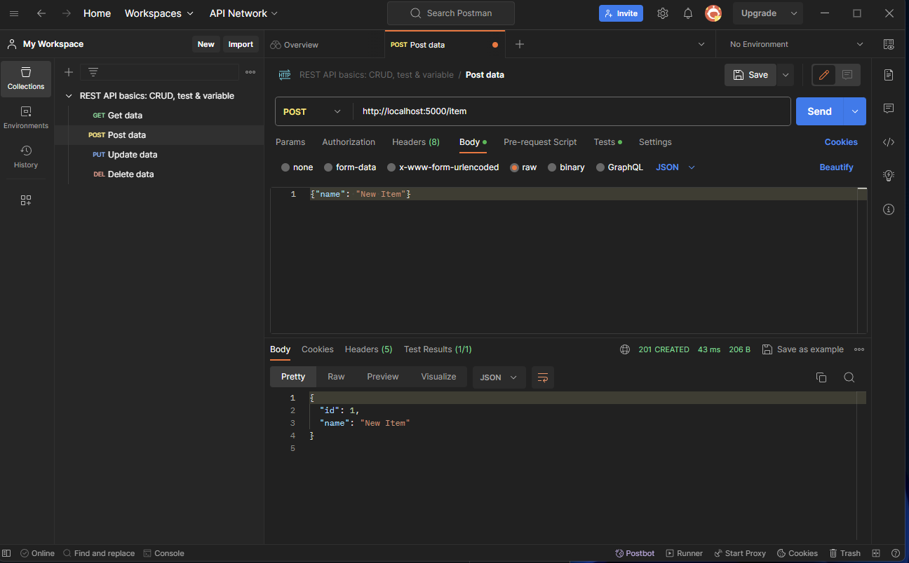

# impart_crud_poc
Simple Docker CRUD app using Postgres backend

## Building and Running the Application

- Have docker installed and running
- Have python installed
- Have pip installed

Install requirements from requirements.txt: `pip install -r requirements.txt`

Build the App: Run `docker-compose build` to build your app.
Run the App: Run `docker-compose up` to start your postgres server.

The app is not running in Docker to help local development. To run the app locally, run `python app.py` from the root directory.

If you decide to run the app in docker, you will need to change the host in the app.py file to `host='db'` instead of `host='localhost'`, and create the python virtual environment in a docker container. Dont worry about this for now but this would remove the need for your local machine to have python, pip, the requirements, etc...

You should have two terminals open, one for the app and one for the database. You can run `docker-compose up` in one terminal and `python app.py` in the other.


## Testing CRUD Operations API

You can test the CRUD operations using Postman or a similar tool. The following are the details for each operation:

From the postman desktop app:



Create (POST)
URL: http://localhost:5000/item
Method: POST
Body: Select 'raw' and 'JSON (application/json)'. Enter the data for the new item, e.g., {"name": "New Item"}.
Send Request: Click "Send". You should receive a response with the created item.

Read (GET)
URL: http://localhost:5000/item/[item_id] (replace [item_id] with an actual item ID)
Method: GET
Send Request: Click "Send". You should receive a response with the item details.

Update (PUT)
URL: http://localhost:5000/item/[item_id] (replace [item_id] with the ID of the item to update)
Method: PUT
Body: Similar to POST, provide the updated data.
Send Request: Click "Send". You should receive a response with the updated item data.

Delete (DELETE)
URL: http://localhost:5000/item/[item_id] (replace [item_id] with the ID of the item to delete)
Method: DELETE
Send Request: Click "Send". You should receive a confirmation response.

## Messing around with the Database

The database and table construction is handled in the main.py file. For learning, it may be useful to also mess about with the database directly. You can do this by running the following commands in the terminal:

`docker exec -it impart_crud_poc_db_1 bash` -- the container name here may change!
`psql -U user -d mydatabase` -- This will log you into the database as the user 'user' and the database 'mydatabase'

`\l` -- list databases
`\dt` -- list tables
`\d table_name` -- describe table

Some other useful psql commands you can use to mess around with the db can be found here

https://hasura.io/blog/top-psql-commands-and-flags-you-need-to-know-postgresql/

Me selecting all from the item table:
```sql
    mydatabase=# SELECT * from item;
    id |   name
    ----+----------
    1 | New Item
    (1 row)
```

## Extending the Flask CRUD API

This document provides guidelines on how to extend the existing Flask CRUD API, which currently includes operations for managing Item entities. You'll learn how to add new database tables, establish table relationships, and create additional API endpoints.

### Prerequisites
Before extending the API, ensure you have:

- All the pre-requisites describe earlier in the README.md
- Everything running as per the README.md
- Basic knowledge of Python and Flask.
- Familiarity with PostgreSQL and its data types.
- Knowledge of basic API principles.


### Adding a New Table

1. Define the Model:

    - In app/models.py, define a new class for your table.
    - Use SQLAlchemy's db.Column to define fields.

Example:
```python
class NewTable(db.Model):
    id = db.Column(db.Integer, primary_key=True)
    name = db.Column(db.String(80), nullable=False)
    # Add other fields...
```
2. Create the Table:

    - re-run the Flask application. Hit Ctrl-c to stop the app and then run `python -m app.py` again.
    - The table will be created automatically based on your model definition.

### Establishing Table Relationships

1. Define Relationships:

    - Use `db.relationship` to define a relationship between tables.
    - Add foreign key constraints using `db.ForeignKey`.

Example:
```python
class RelatedTable(db.Model):
    id = db.Column(db.Integer, primary_key=True)
    new_table_id = db.Column(db.Integer, db.ForeignKey('new_table.id'))
    new_table = db.relationship('NewTable', backref=db.backref('related_tables', lazy=True))
```

### Adding New API Endpoints

1. Define New Routes:

    - In app/main.py, use Flask decorators to define new routes.
    - Implement the logic for each CRUD operation.

Example:
```python
@app.route('/new_table', methods=['POST'])
def create_new_table_item():
    # Implement creation logic
    pass

@app.route('/new_table/<int:id>', methods=['GET'])
def get_new_table_item(id):
    # Implement read logic
    pass
```

2. Handling Requests and Responses:

    - Use request to access data sent in requests.
    - Use jsonify to send JSON responses.

### Testing

- Test new endpoints using Postman or similar tools.
- Ensure all CRUD operations work as expected.

### Best Practices

- Follow PEP 8 styling guidelines for Python code.
- Write meaningful comments and docstrings.
- Ensure backward compatibility with existing endpoints.
- Follow the Single Responsibility Principle (SRP) when defining classes and methods. Each class/method should have a single responsibility and no two classes/methods should have the same responsibility.

